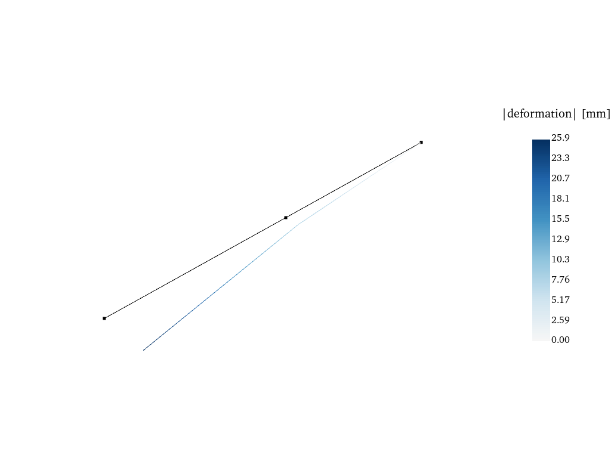
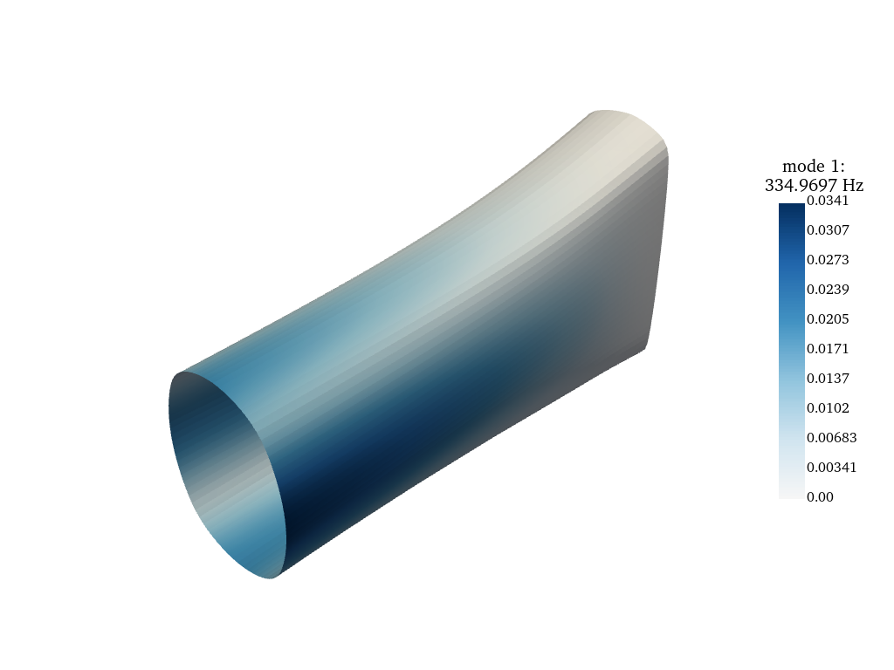
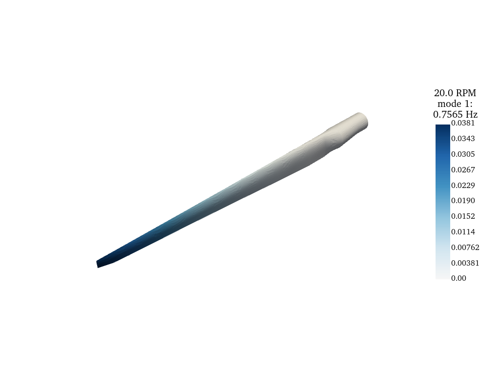
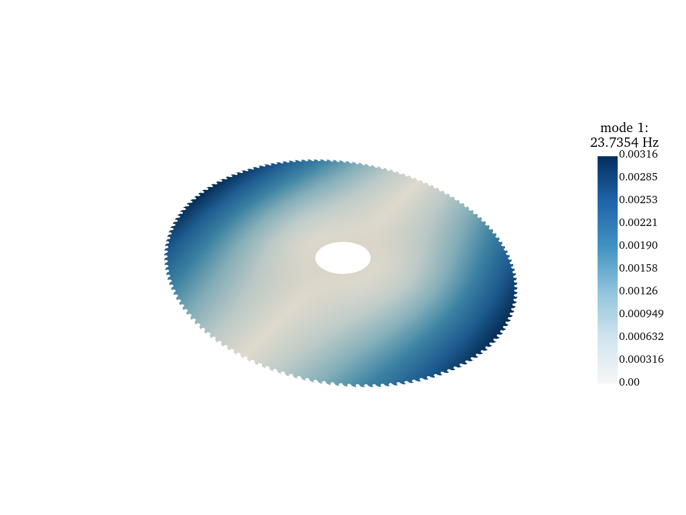
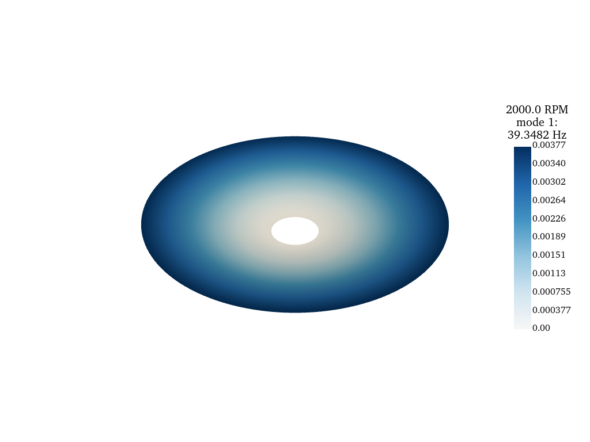
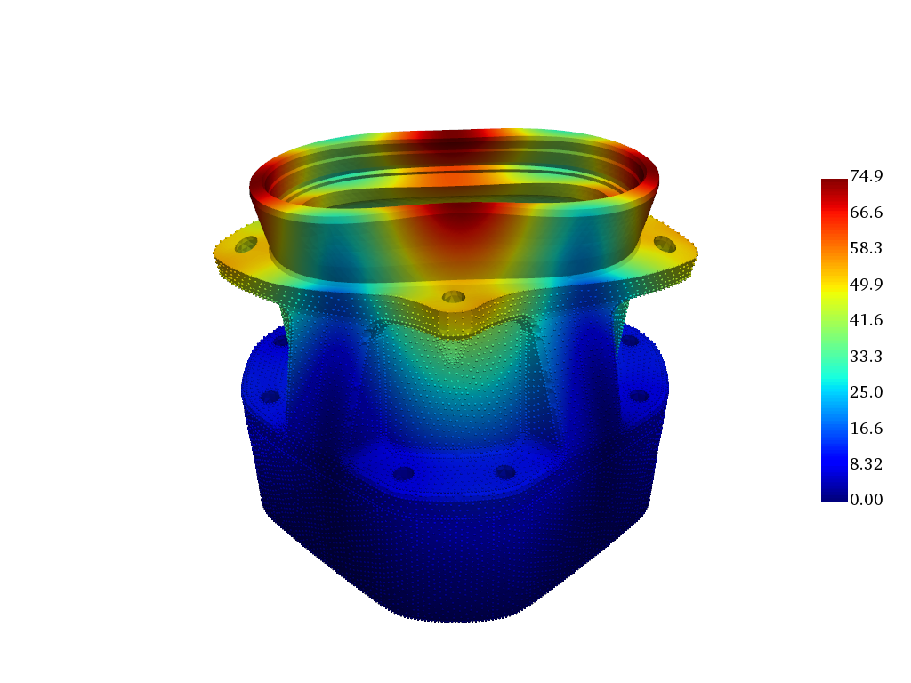
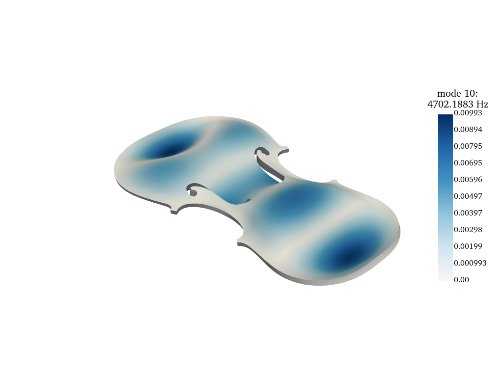
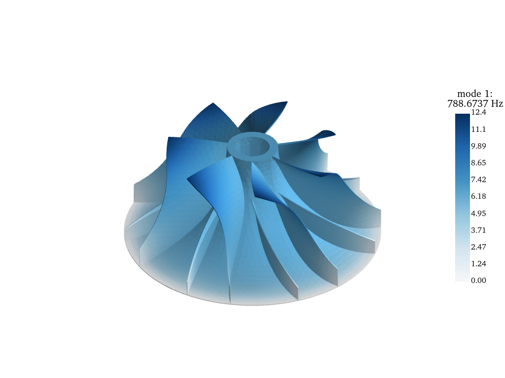
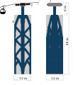
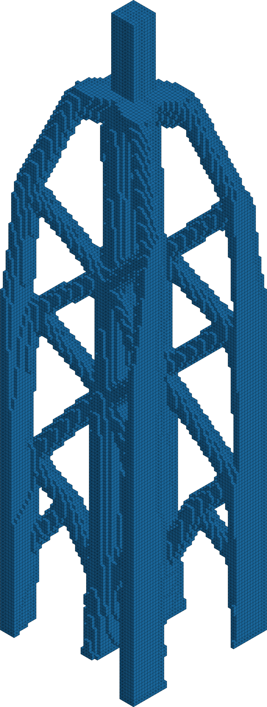

# Examples of modeling and analysis with Kratos Multiphysics

## Simple beam models (complete Python modeling): KratosSimplePythonModels
<p align=left></p>

## Composite robot arm: RobotArm.gid
<p align=left></p> 

## Wind turbine rotor blade: RotorBladeNREL.gid
<p align=left></p>

## Saw blade: SawBlade.gid
<p align=left></p>

## Simplified saw blade: SawBladeToothless.gid
<p align=left></p>

## Gear housing
<p align=left></p>

## Violin top plate: Violin.gid
<p align=left></p>

## Compressor impeller
<p align=left></p>

## Topology optimization - Cableway pylon
<p align=left></p>

Clone with all models with the following command:
```bash
git clone --recurse-submodules https://github.com/unibz-Leichtbau/KratosExamples
```
